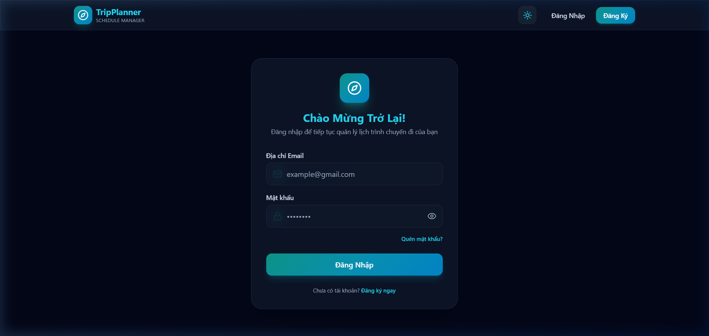
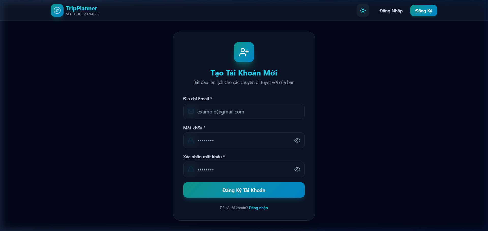
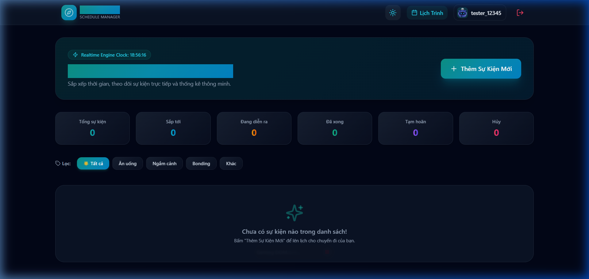
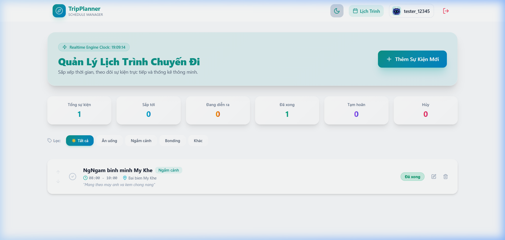
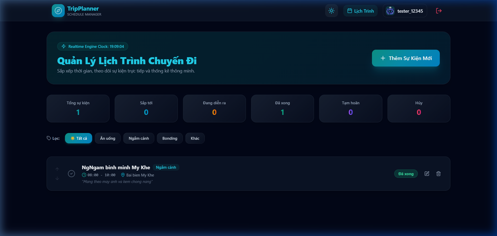
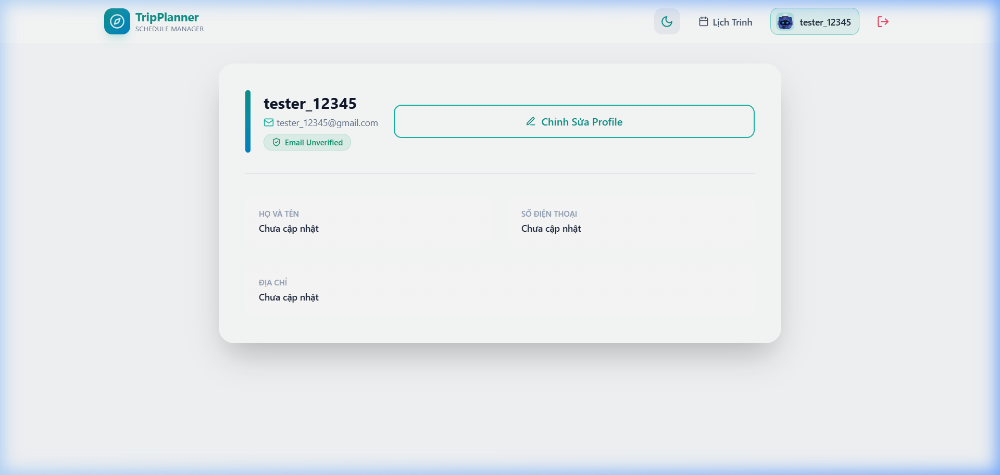

# ✈️ Travel Schedule Manager (Quản Lý Lịch Trình Chuyến Đi)


Ứng dụng web giúp bạn lên lịch trình, quản lý sự kiện và theo dõi các hoạt động trong chuyến du lịch một cách trực quan, khoa học. Được thiết kế với giao diện **Glassmorphism hiện đại** và bảng màu **Tương đồng (Analogous Palette: Teal, Cyan, Sky, Emerald)** mang lại cảm giác dễ chịu, thanh lịch và hiển thị chữ rõ nét tương thích 100% trên mọi trình duyệt.

🔗 **Link Demo Trực Tuyến**: [https://travel-schedule-manager-f8i86ymjc-wanphu-ais-projects.vercel.app/](https://travel-schedule-manager-f8i86ymjc-wanphu-ais-projects.vercel.app/)

---

## 🎨 Phối Màu Tương Đồng (Analogous Color Scheme)
*   **Teal (`#0d9488`)**: Màu chính sắc nét cho tiêu đề, các nút bấm primary, Logo và icon chủ đạo.
*   **Cyan (`#0891b2`)**: Điểm nhấn phụ và màu chữ phản quang nổi bật khi tương tác ở Dark mode.
*   **Sky (`#0284c7`)**: Gam màu chuyển tiếp cho viền kính thủy tinh (Glassmorphism borders) và background gradients.
*   **Emerald (`#059669`)**: Màu hiển thị cho các sự kiện hoàn thành, badge trạng thái thành công.

---

## 🌟 Tính Năng Nổi Bật

1. **Xác Thực Người Dùng Bảo Mật (Authentication)**: Đăng ký, đăng nhập và bảo vệ router bằng Firebase Auth. Hỗ trợ hiển thị lỗi chi tiết khi nhập sai mật khẩu (yêu cầu chữ hoa, chữ thường, số, ký tự đặc biệt).
2. **Quản Lý Lịch Trình Chuyến Đi (CRUD Events)**:
   - Tạo mới sự kiện với Tiêu đề, Thời gian bắt đầu/kết thúc, Địa điểm, Phân loại hoạt động (Ăn uống, Ngắm cảnh, Bonding, Khác) và Mô tả chi tiết.
   - Cập nhật trạng thái sự kiện trực tiếp (Sắp tới, Đang diễn ra, Đã xong, Tạm hoãn, Hủy).
   - Xóa sự kiện không cần thiết.
   - **Chống trùng lặp khung giờ (Overlapping Time Validation)**: Tự động cảnh báo và chặn tạo các sự kiện có khung giờ đè lên nhau.
3. **Realtime Engine & Trình Đếm Ngược**: Đồng hồ thời gian thực và tự động cập nhật trạng thái sự kiện dựa trên giờ hiện tại của hệ thống.
4. **Thống Kê Thông Minh (Interactive Statistics)**: Bảng đếm số lượng sự kiện theo từng trạng thái (Tổng số, Sắp tới, Đang diễn ra, Đã xong...).
5. **Bộ Lọc Tiện Lợi (Filtering)**: Lọc nhanh các sự kiện theo thể loại hoạt động.
6. **Quản Lý Profile**: Trang cập nhật thông tin cá nhân (Họ tên, Số điện thoại, Địa chỉ).
7. **Theme Toggle**: Chuyển đổi linh hoạt giữa giao diện Tối (Dark mode) và Sáng (Light mode) lưu trên LocalStorage.
8. **Tối Ưu Hiển Thị Tiêu Đề (Cross-Browser Typography Fix)**: Sửa toàn bộ hiệu ứng phủ màu nền làm mờ tiêu đề thành màu chữ đơn sắc rõ nét trên mọi thiết bị và trình duyệt.

---

## 📸 Ảnh Giao Diện Minh Họa

### 1. Trang Đăng Nhập (Login Page)


### 2. Trang Đăng Ký (Register Page)


### 3. Trang Lịch Trình Rỗng (Empty Dashboard)


### 4. Giao Diện Sáng (Light Mode Dashboard)


### 5. Quản Lý Sự Kiện Thực Tế (Dashboard with Events)


### 6. Trang Thông Tin Cá Nhân (Profile Page)


---

## 📂 Cấu Trúc Thư Mục Dự Án

```text
travel-schedule-manager/
├── public/
│   └── screenshots/         # Nơi lưu trữ hình ảnh minh họa cho README
├── src/
│   ├── assets/              # Tài nguyên hình ảnh, SVG
│   ├── components/          # UI Components
│   │   ├── common/          # Button, InputField với password toggle
│   │   ├── forms/           # EventModalForm (Đã tối ưu tiêu đề chữ)
│   │   └── layout/          # Navbar (Đã tối ưu logo TripPlanner)
│   ├── contexts/            # AuthContext, ThemeContext
│   ├── firebase/            # firebaseConfig.js
│   ├── hooks/               # useAuth, useScheduleEngine (Realtime Clock)
│   ├── pages/               # Login, Register, Profile, Schedule (Đã sửa lỗi tiêu đề)
│   ├── routes/              # ProtectedRoute, PublicRoute
│   ├── services/            # authService, userService, eventService (Firestore & LocalStorage)
│   ├── utils/               # firebaseErrorMessages.js
│   ├── validations/         # authSchema.js, eventSchema.js (Zod)
│   ├── App.jsx              # Định tuyến Router (react-router-dom)
│   ├── index.css            # Cấu hình TailwindCSS & Glassmorphism
│   └── main.jsx
├── test/                    # Các file unit test (Vitest)
│   ├── authValidation.test.js
│   ├── firebaseError.test.js
│   ├── manualTestCases.md   # Kịch bản Manual Testing
│   └── setup.js
├── .env.example             # File mẫu chứa các biến môi trường Firebase
├── vercel.json              # Cấu hình rewrite SPA routing trên Vercel
├── tailwind.config.js       # Cấu hình Tailwind (Theme Analogous)
├── vite.config.js
└── README.md
```

---

## 🚀 Hướng Dẫn Chạy Dự Án Dưới Local

### 1. Tải Mã Nguồn & Cài Đặt Thư Viện
```bash
git clone https://github.com/<TEN_GITHUB_CUA_BAN>/travel-schedule-manager.git
cd travel-schedule-manager
npm install
```

### 2. Thiết Lập Biến Môi Trường (Environment Variables)
Tạo file `.env` ở thư mục gốc và điền các khóa Firebase của bạn:
```env
VITE_FIREBASE_API_KEY=your_api_key
VITE_FIREBASE_AUTH_DOMAIN=your_auth_domain
VITE_FIREBASE_PROJECT_ID=your_project_id
VITE_FIREBASE_STORAGE_BUCKET=your_storage_bucket
VITE_FIREBASE_MESSAGING_SENDER_ID=your_messaging_sender_id
VITE_FIREBASE_APP_ID=your_app_id
```

### 3. Chạy Chế Độ Phát Triển (Development)
```bash
npm run dev
```
👉 Ứng dụng sẽ chạy tại địa chỉ: `http://localhost:5173`

### 4. Chạy Unit Tests
```bash
npm test
```

### 5. Build Sản Phẩm
```bash
npm run build
```
Sản phẩm sau khi đóng gói sẽ nằm trong thư mục `dist`.

---

## 🔒 Cấu Hình Bảo Mật Firestore (Cloud Firestore Security Rules)
Hãy dán đoạn mã quy tắc bảo mật này vào phần **Rules** trên Firebase Console để bảo vệ dữ liệu người dùng:
```javascript
rules_version = '2';
service cloud.firestore {
  match /databases/{database}/documents {
    match /users/{userId} {
      allow read, write: if request.auth != null && request.auth.uid == userId;
      match /events/{eventId} {
        allow read, write: if request.auth != null && request.auth.uid == userId;
      }
    }
  }
}
```
