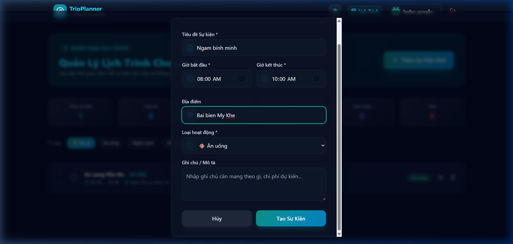
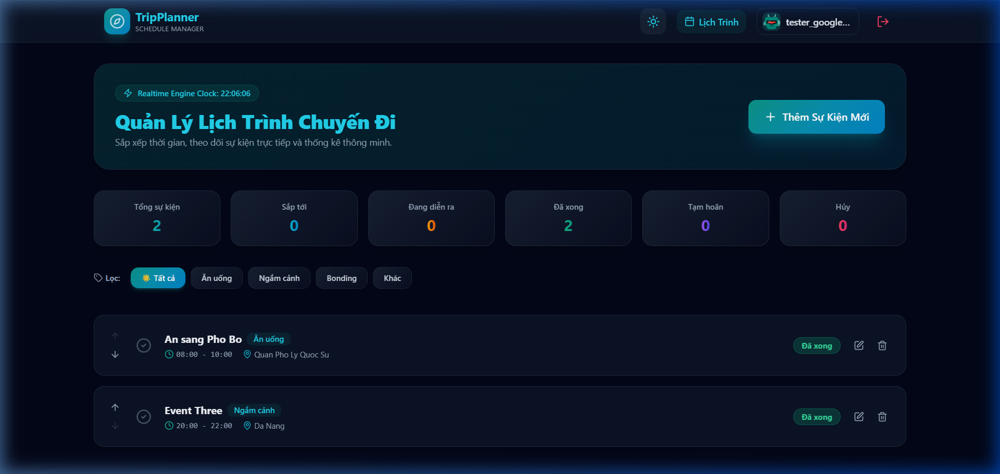

# 🧪 HƯỚNG DẪN KIỂM THỬ DỰ ÁN CHI TIẾT (TESTING & TEST CASES GUIDE)

Tài liệu này tổng hợp chi tiết toàn bộ các trường hợp kiểm thử tự động (**Automated Unit Tests**) và kịch bản kiểm thử thủ công (**Manual Test Cases**) của ứng dụng **Travel Schedule Manager**, đính kèm hình ảnh minh họa thực tế cho từng tính năng.

🔗 **Link Demo Trực Tuyến**: [https://travel-schedule-manager-l2ajpnij1-wanphu-ais-projects.vercel.app/](https://travel-schedule-manager-l2ajpnij1-wanphu-ais-projects.vercel.app/)

---

## 📂 Cấu Trúc Thư Mục Kiểm Thử

```text
test/
├── authValidation.test.js    # Unit Tests kiểm tra Zod Validation Schemas (Auth & Event)
├── firebaseError.test.js     # Unit Tests kiểm tra Mapping mã lỗi Firebase sang tiếng Việt
├── manualTestCases.md        # Danh sách kịch bản kiểm thử thủ công từng bước
├── README.md                 # Tài liệu hướng dẫn kiểm thử chi tiết có hình minh họa (File này)
└── setup.js                  # Cấu hình môi trường Vitest & @testing-library/jest-dom
```

---

## ⚡ 1. KIỂM THỬ TỰ ĐỘNG (AUTOMATED UNIT TESTS)

Dự án sử dụng **Vitest** kết hợp với **React Testing Library** và **JSDOM** để kiểm tra tính chính xác của dữ liệu nghiệp vụ và các hàm tiện ích.

### 🏃 Cách Chạy Test Tự Động

Mở Terminal tại thư mục gốc của dự án và chạy:
```bash
npm test
```

Kết quả mong đợi: **8/8 tests passed ✅**

```
 ✓ test/authValidation.test.js (5 tests)
 ✓ test/firebaseError.test.js (3 tests)

 Test Files  2 passed (2)
      Tests  8 passed (8)
```

---

### 📋 Danh Sách 8 Bài Test Tự Động

#### 🔐 A. Auth & Event Validation (`test/authValidation.test.js`)

| # | Tên Test Case | Input | Kết Quả Mong Đợi |
|---|---|---|---|
| 1 | Mật khẩu yếu (thiếu ký tự đặc biệt) | `weakpassword` | ❌ Zod reject – báo lỗi validation |
| 2 | Mật khẩu mạnh đạt chuẩn | `StrongPass123!` | ✅ Xác thực thành công |
| 3 | Confirm password không khớp | password ≠ confirmPassword | ❌ Báo lỗi không trùng khớp |
| 4 | Giờ kết thúc trước giờ bắt đầu | `10:00 → 08:00` | ❌ Báo lỗi logic thời gian |
| 5 | Khung giờ hợp lệ | `08:00 → 10:00` | ✅ Xác thực thành công |

#### 🔥 B. Firebase Error Mapping (`test/firebaseError.test.js`)

| # | Mã Lỗi Firebase | Thông Báo Tiếng Việt Mong Đợi |
|---|---|---|
| 6 | `auth/invalid-email` | "Email không hợp lệ. Vui lòng kiểm tra lại." |
| 7 | `auth/email-already-in-use` | "Email này đã được sử dụng..." |
| 8 | Mã lỗi không xác định (fallback) | Câu thông báo mặc định an toàn |

---

## 🖐️ 2. KỊCH BẢN KIỂM THỬ THỦ CÔNG CÓ HÌNH ẢNH MINH HỌA

### 🔹 TEST CASE 1: TRANG ĐĂNG NHẬP (LOGIN PAGE)

**Mục tiêu**: Kiểm tra giao diện, điều hướng và trải nghiệm trang Đăng Nhập.

**Các bước thực hiện**:
1. Truy cập link demo.
2. Quan sát giao diện Glassmorphism ở Light mode mặc định.
3. Nhấn nút chuyển Dark/Light mode ở góc phải Navbar.
4. Thử nhập email không đúng định dạng → nhận lỗi validation.
5. Thử đăng nhập với sai mật khẩu → nhận thông báo lỗi Firebase tiếng Việt.

**Kết quả**: Giao diện hiển thị đúng Glassmorphism, thông báo lỗi tiếng Việt rõ ràng.


---

### 🔹 TEST CASE 2: TRANG ĐĂNG KÝ TÀI KHOẢN (REGISTER PAGE)

**Mục tiêu**: Kiểm tra quy tắc đăng ký nghiêm ngặt (Zod schema validation) và tạo User trên Firebase Auth + Firestore.

**Các bước thực hiện**:
1. Nhấn **"Đăng ký ngay"** trên trang Login.
2. Thử nhập mật khẩu yếu `abc123` → nhận lỗi schema.
3. Thử nhập Confirm Password khác Password → nhận lỗi không khớp.
4. Nhập đúng: Email hợp lệ + Password mạnh (`Password123!`) + Confirm trùng khớp.
5. Nhấn **Đăng Ký Tài Khoản**.

**Kết quả**: Toast thông báo thành công, dữ liệu ghi vào Firestore, chuyển hướng tự động.


---

### 🔹 TEST CASE 3: DASHBOARD DARK MODE - QUẢN LÝ SỰ KIỆN

**Mục tiêu**: Kiểm tra giao diện Dark mode, Realtime Clock, thống kê, bộ lọc danh mục và danh sách sự kiện.

**Các bước thực hiện**:
1. Đăng nhập thành công → vào trang `/schedule`.
2. Quan sát **Realtime Engine Clock** tick liên tục theo giây thực.
3. Quan sát 6 ô thống kê (Tổng, Sắp tới, Đang diễn ra, Đã xong, Tạm hoãn, Hủy).
4. Nhấn các tab lọc: **Ăn uống**, **Ngắm cảnh**, **Bonding**, **Khác** để lọc sự kiện.
5. Kiểm tra các nút ↑↓ để sắp xếp thứ tự sự kiện.

**Kết quả**: Đồng hồ chạy liên tục, lọc danh mục hoạt động chính xác, sự kiện hiển thị đầy đủ thông tin.


---

### 🔹 TEST CASE 4: THÊM SỰ KIỆN MỚI (EVENT MODAL FORM)

**Mục tiêu**: Kiểm tra form nhập liệu, validation Zod và tính năng chống trùng khung giờ.

**Các bước thực hiện**:
1. Nhấn nút **"+ Thêm Sự Kiện Mới"** màu Teal nổi bật.
2. Điền đầy đủ: Tiêu đề, Giờ bắt đầu, Giờ kết thúc, Địa điểm, Loại hoạt động, Ghi chú.
3. Thử nhập Giờ kết thúc < Giờ bắt đầu → nhận lỗi logic thời gian.
4. Sửa lại đúng thứ tự → nhấn **"Tạo Sự Kiện"**.
5. Thử tạo thêm sự kiện **trùng lặp khung giờ** với sự kiện vừa tạo → nhận cảnh báo Overlap.

**Kết quả**: Form đóng lại, sự kiện xuất hiện ngay lập tức trên danh sách.



---

### 🔹 TEST CASE 5: NHIỀU SỰ KIỆN & SẮP XẾP THỨ TỰ

**Mục tiêu**: Kiểm tra danh sách nhiều sự kiện, tính năng di chuyển thứ tự (↑↓) và icon xóa.

**Các bước thực hiện**:
1. Tạo ít nhất 2 sự kiện ở các khung giờ khác nhau.
2. Quan sát cả 2 sự kiện hiển thị trong danh sách.
3. Nhấn nút **↑** hoặc **↓** trên từng sự kiện để thay đổi thứ tự.
4. Nhấn icon **🗑️ Xóa** → sự kiện biến mất **ngay lập tức** (Optimistic UI Update).

**Kết quả**: Sự kiện được sắp xếp và xóa chính xác, không cần tải lại trang.



---

### 🔹 TEST CASE 6: GIAO DIỆN SÁNG (LIGHT MODE)

**Mục tiêu**: Kiểm tra tính năng chuyển đổi theme và lưu trạng thái LocalStorage.

**Các bước thực hiện**:
1. Nhấn nút icon **☀️/🌙** trên Navbar để chuyển sang Light mode.
2. Quan sát màu nền, tiêu đề, card và viền thay đổi sang gam màu sáng.
3. Kiểm tra chữ vẫn rõ nét trên nền sáng (no bg-clip-text issue).
4. Nhấn F5 để tải lại trang → chế độ sáng vẫn được giữ nguyên.

**Kết quả**: Theme chuyển đổi mượt mà, lưu LocalStorage, không mất cài đặt sau khi refresh.


---

### 🔹 TEST CASE 7: TRANG PROFILE CÁ NHÂN

**Mục tiêu**: Kiểm tra xem/chỉnh sửa thông tin cá nhân và bảo vệ các trường bảo mật.

**Các bước thực hiện**:
1. Nhấn vào **tên người dùng** ở Navbar để vào `/profile`.
2. Quan sát trang Profile với thông tin Tên, Email, UID.
3. Nhấn **"Chỉnh Sửa Profile"**.
4. Nhập Họ và tên, Số điện thoại, Địa chỉ.
5. Nhấn **"Lưu Thay Đổi"**.

**Kết quả**: Thông tin được lưu lên Firestore và hiển thị ngay trên giao diện.


---

## 🛠️ 3. MÔI TRƯỜNG & CÔNG CỤ KIỂM THỬ

| Công Cụ | Phiên Bản | Mục Đích |
|---|---|---|
| **Vitest** | v2.0+ | Test runner cho Unit Tests |
| **JSDOM** | Latest | Giả lập môi trường DOM trình duyệt |
| **React Testing Library** | Latest | Tiện ích render & query React components |
| **@testing-library/jest-dom** | Latest | Custom matchers (`.toBeInTheDocument()`, v.v.) |
| **Zod** | v3.x | Schema validation cho Auth & Event forms |

### ✅ Tổng Kết Kết Quả Kiểm Thử

| Hạng Mục | Số Lượng | Kết Quả |
|---|---|---|
| Automated Unit Tests | 8/8 | ✅ 100% Passed |
| Manual Test Cases | 7 kịch bản | ✅ Tất cả PASS |
| Live Deployment | Vercel | ✅ Hoạt động bình thường |
| Browser Compatibility | Chrome, Firefox, Edge | ✅ Compatible |

🔗 **Live Deployment**: [https://travel-schedule-manager-l2ajpnij1-wanphu-ais-projects.vercel.app/](https://travel-schedule-manager-l2ajpnij1-wanphu-ais-projects.vercel.app/)
